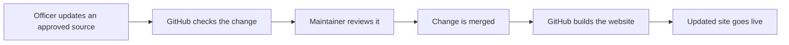

# Officer guide to the Mahjong Club website

This guide explains how the website works and how officers can keep it current.
You do not need to know how to code to update ordinary club information.

## Start here

| What you want to change                   | Where to change it          | What happens next                              |
| ----------------------------------------- | --------------------------- | ---------------------------------------------- |
| Homepage or About page wording            | Officer Google Sheet        | GitHub prepares a review request               |
| Tagline                                   | Officer Google Sheet        | GitHub prepares a review request               |
| Officer names or contact details          | Officer Google Sheet        | GitHub prepares a review request               |
| Instagram handle or GroupMe link          | Officer Google Sheet        | GitHub prepares a review request               |
| Meeting time or room                      | Public club Google Calendar | The website refreshes automatically            |
| Scores or leaderboard results             | Private score workbook      | A maintainer runs the private score update     |
| Club photos                               | Private photo inbox         | A maintainer prepares and adds approved photos |
| Layout, colors, animations, or Guide page | Website code                | Ask a maintainer                               |

The Sheet is the only place to change wording. Editing the website's own copy
file directly looks like it works and then breaks the next build, so the Sheet
is not merely the easy route, it is the supported one.

If you are unsure where a change belongs, ask the website maintainer before adding it anywhere public.

## What the website does

The website has four public pages:

- **Home** welcomes visitors, shows the next meetings, and introduces the club.
- **About** explains how the club plays, introduces the officers, and tells visitors how to join.
- **Guide** gives new players a quick introduction to mahjong terms and hands.
- **Leaderboard** publishes approved display names and scored-game results.

The finished website is a set of static files hosted by GitHub Pages.
There is no member login, payment system, or private database on the website.

## The publishing flow

For homepage and About page edits, GitHub creates a **pull request**.
A pull request is simply a proposed change with a page showing exactly what will be added and removed.
Merging it approves the change and starts publication.

## Update homepage or About page content

Use the officer Google Sheet for wording, social links, contact information, and officer display names.

1. Open the officer website-content Sheet.
2. Edit only cells in the `value` column.
3. Do not rename, add, or remove anything in the `key` column.
4. Read the change as if it were already visible to anyone online.
5. For each officer name, confirm that person has agreed to the exact public name shown.
6. Set that officer's `.consent` value to `TRUE`.
7. Set `ready_to_publish` to `TRUE` when the whole Sheet is ready for review.

GitHub checks the Sheet once an hour.
A maintainer can also start the check from the repository's **Actions** page.

If the content passes its checks, GitHub opens a pull request titled **Website content update**.
The Sheet cannot publish directly.

## Review a website-content pull request

1. Open the **Website content update** pull request.
2. Read the proposed-changes table in its description.
3. Open **Files changed** and check the wording, names, email address, location, and links.
4. Confirm that the automated checks are green.
5. Merge the pull request if everything is correct.

The site normally updates a few minutes after the merge.

Leaving `ready_to_publish` set to `TRUE` is safe.
GitHub does nothing when the Sheet matches the website.

## Update meetings

The homepage reads future meetings from the club's public Google Calendar.

When editing a calendar event:

- Use the real start and end time.
- Put only a public building and room in the location field.
- Do not include a home address or a person's live whereabouts.
- Remove cancelled meetings from the calendar.

The automatic refresh runs Fridays at 10:00PM EST.
For a same-week correction, ask a maintainer to run **Refresh meetings** from GitHub Actions.

## Update scores

Scores use a separate private process because the source workbook and roster contain real names.
They must never be uploaded to the public repository, attached to a pull request, or pasted into GitHub Actions.

The score maintainer:

1. Updates the private workbook.
2. Runs the score-processing command on an approved computer.
3. Reviews the public display names and calculated results.
4. Commits only the generated public JSON files.

Players who opt out are removed during this process.

## Add photos

Obtain permission from everyone who is clearly identifiable before publishing a photo.
Keep original images outside the public repository.

The photo maintainer places originals in the private `photo-inbox/` folder.
The preparation tool then:

- Corrects camera orientation.
- Resizes oversized images.
- Converts them to WebP.
- Removes hidden camera, location, and editing metadata.
- Reports the dimensions needed by the website.

GitHub checks public images again before deployment and rejects files that still contain prohibited metadata.
The original photo remains local and is never committed.

## Information that is safe to publish

- Club meeting times and public campus rooms.
- The club's public email and social links.
- Officer names in the exact form each officer approved.
- Player display names and results covered by the club's scoring policy.
- Photos with permission and cleaned metadata.

## Information that must stay private

- Personal addresses, phone numbers, passwords, access tokens, or private links.
- Unapproved full names or photos.
- Original photos containing camera or location metadata.

When in doubt, leave the information out and ask before publishing.

## If something goes wrong

**No pull request appears after editing the Sheet**

Check that `ready_to_publish` is `TRUE`, all required values are present, and every displayed officer has consent set to `TRUE`.
There can be only one open website-content proposal at a time.

**The automated checks are red**

Open the failed check and read its first clear error message.
Do not merge the pull request.
Send the error to the website maintainer if the fix is not obvious.

**The site still shows old information**

Confirm that the pull request was merged and that **Deploy to GitHub Pages** finished successfully in Actions.
Browser caching can also delay a visible change, so refresh the page once.

**Private information was published**

Contact the repository owner immediately.
Deleting the visible file is not enough because Git keeps earlier versions in its history.

## Useful terms

- **GitHub Actions:** The automated checks and publishing jobs.
- **Pull request:** A proposed change waiting for review.
- **Merge:** Approving a pull request and adding it to the website source.
- **Deploy:** Publishing the latest approved version to GitHub Pages.
- **Repository:** The GitHub project containing the website files and their history.
- **Public JSON:** Generated website data that contains display names and results but not the private roster.
